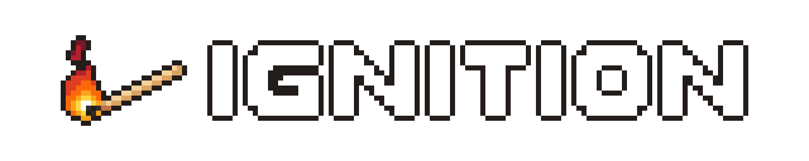

# Ignition2D 

**THIS PROJECT IS CURRENTLY IN DEVELOPMENT AND WILL BE RENAMED TO IGNITION IN THE COMING FUTURE!** 
*README to be updated...*

Ignition will be a 2D game engine written in C++. I am currently working on setting out my project and design. It will be a suite of many different tools and will be used to create a game I am working on (currently only the music and some artwork - but I am looking forward to this).